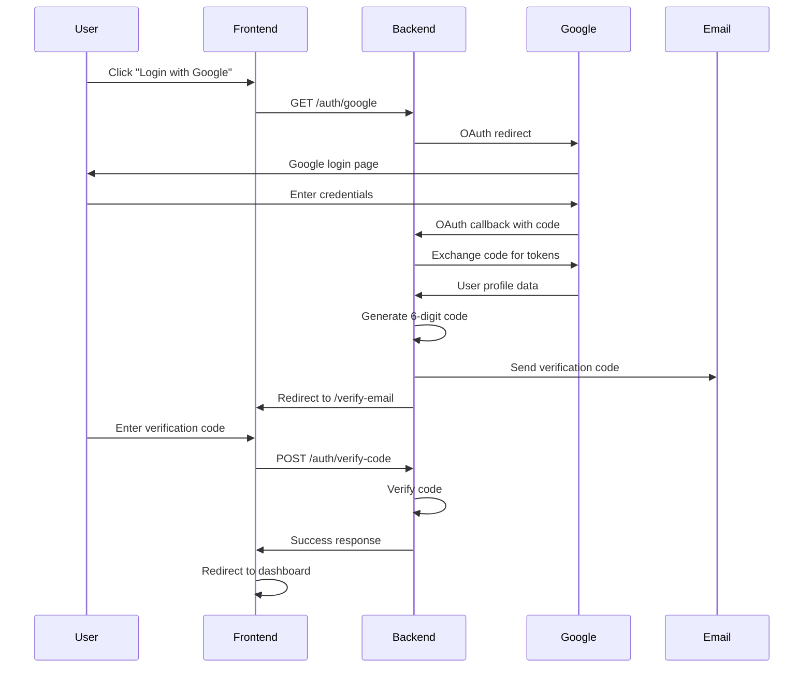
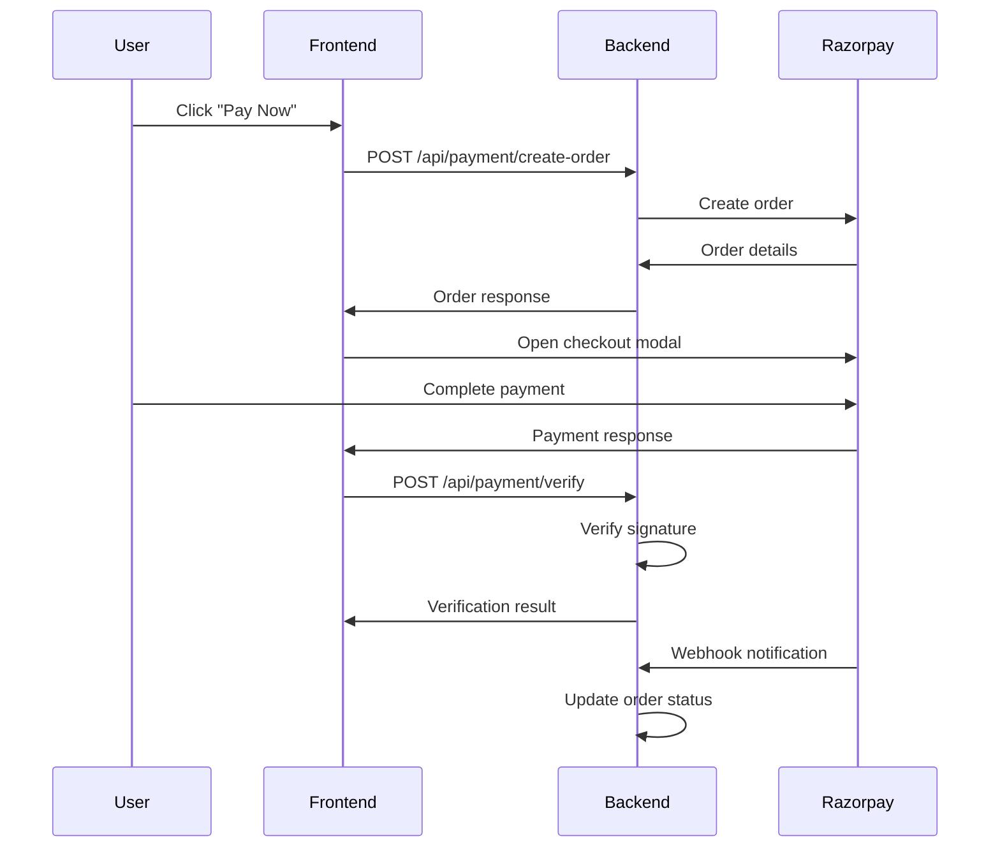

# 🏪 Chronos Watch Shop

[](https://github.com/lazypanda0810/chronos-style-shop-08)
[](https://opensource.org/licenses/MIT)
[](https://nodejs.org/)
[](https://www.mongodb.com/)
[](https://razorpay.com/)
[](https://developers.google.com/identity/protocols/oauth2)

> A premium e-commerce platform for luxury watches with secure authentication and payment processing.

## 📖 Project Overview

**Chronos Watch Shop** is a full-stack e-commerce application built with modern web technologies, featuring secure Google OAuth authentication with email verification, integrated Razorpay payment gateway, and a responsive React frontend. The platform specializes in luxury watches with a premium user experience.

### 🌟 Key Features

- **🔐 Secure Authentication**: Google OAuth 2.0 with email double-verification
- **💳 Payment Integration**: Complete Razorpay payment gateway with webhooks
- **📱 Responsive Design**: Mobile-first approach with modern UI components
- **🛡️ Security First**: PCI DSS compliant payments, CSRF protection, rate limiting
- **⚡ Performance**: Optimized with caching, compression, and efficient queries
- **📊 Analytics Ready**: Built-in tracking and analytics support
- **🌐 SEO Optimized**: Server-side rendering and meta tag management

---

## 🛠️ Tech Stack

### Frontend

- **React 18.3.1** - Modern React with Hooks
- **TypeScript** - Type-safe development
- **Vite 5.4.20** - Fast build tool and dev server
- **Tailwind CSS** - Utility-first CSS framework
- **shadcn/ui** - High-quality React components
- **React Router v6** - Client-side routing
- **Tanstack Query** - Data fetching and caching
- **Lucide Icons** - Beautiful icon library

### Backend

- **Node.js 18+** - JavaScript runtime
- **Express.js** - Web application framework
- **MongoDB** - NoSQL database
- **Mongoose** - ODM for MongoDB
- **Passport.js** - Authentication middleware
- **Express Session** - Session management
- **Razorpay SDK** - Payment processing
- **Nodemailer** - Email service
- **Winston** - Logging library

### Security & Tools

- **Helmet** - Security headers
- **CORS** - Cross-origin resource sharing
- **Rate Limiting** - Request rate limiting
- **Data Sanitization** - XSS and injection protection
- **bcrypt** - Password hashing
- **JWT** - JSON Web Tokens
- **dotenv** - Environment variable management

---

## 📋 Prerequisites

Before running this application, make sure you have the following installed:

- **Node.js** (v18 or higher) - [Download](https://nodejs.org/)
- **MongoDB** (v6.0 or higher) - [Download](https://www.mongodb.com/try/download/community)
- **Git** - [Download](https://git-scm.com/)
- **Google Cloud Console Account** - [Setup](https://console.cloud.google.com/)
- **Razorpay Account** - [Signup](https://razorpay.com/)
- **Gmail Account** (for email service)

---

## 🚀 Quick Start

For a fast setup, run the automated setup script:

```bash
# Clone the repository
git clone https://github.com/lazypanda0810/chronos-style-shop-08.git
cd chronos-style-shop-08

# Run the automated setup script
./setup.sh
```

This script will:

- ✅ Check all prerequisites (Node.js, npm, MongoDB)
- ✅ Install all dependencies
- ✅ Create environment files
- ✅ Validate configurations
- ✅ Provide next steps

### Manual Validation

To check your setup at any time:

```bash
# Run complete validation
node validate.js

# Or check individual components
cd backend && npm run check
cd frontend && npm run check
```

---

## 🚀 Installation Instructions

### 1. Clone the Repository

```bash
git clone https://github.com/lazypanda0810/chronos-style-shop-08.git
cd chronos-style-shop-08
```

### 2. Backend Setup

```bash
# Navigate to backend directory
cd backend

# Install dependencies
npm install

# Copy environment file
cp .env.example .env

# Edit .env file with your credentials (see Environment Setup section)

# Run startup validation check
npm run check

# If all checks pass, start development server
npm run dev
```

### 3. Frontend Setup

```bash
# Navigate to frontend directory (from project root)
cd frontend

# Install dependencies
npm install

# Start development server
npm run dev
```

### 4. Database Setup

```bash
# Start MongoDB service
# On Windows: net start MongoDB
# On macOS: brew services start mongodb-community
# On Linux: sudo systemctl start mongod

# Create database and collections (optional - will be created automatically)
mongosh
use chronos_watch_shop
```

---

## ⚙️ Environment Setup

### Backend Environment Variables

Create a `.env` file in the `backend` directory with the following variables:

```env
# Server Configuration
PORT=5000
NODE_ENV=development

# Database Configuration
MONGODB_URI=mongodb://localhost:27017/chronos_watch_shop

# Session Configuration
SESSION_SECRET=your-super-secret-session-key-change-this-in-production

# Google OAuth Configuration
GOOGLE_CLIENT_ID=your-google-client-id-from-console
GOOGLE_CLIENT_SECRET=your-google-client-secret-from-console

# Razorpay Configuration
RAZORPAY_KEY_ID=rzp_test_your_key_id
RAZORPAY_KEY_SECRET=your_key_secret
RAZORPAY_WEBHOOK_SECRET=your_webhook_secret

# Email Configuration (Gmail SMTP)
EMAIL_HOST=smtp.gmail.com
EMAIL_PORT=587
EMAIL_USER=your-gmail@gmail.com
EMAIL_PASSWORD=your-gmail-app-password
EMAIL_FROM=noreply@chronoswatch.com
EMAIL_FROM_NAME=Chronos Watch Shop

# Payment Configuration
PAYMENT_MODE=test
CURRENCY=INR
PAYMENT_SUCCESS_URL=http://localhost:8080/payment/success
PAYMENT_FAILURE_URL=http://localhost:8080/payment/failure

# CORS Configuration
CORS_ORIGIN=http://localhost:8080

# JWT Configuration
JWT_SECRET=your_jwt_secret_key_here
JWT_EXPIRES_IN=7d

# Security Configuration
VERIFICATION_CODE_EXPIRES=600000
```

### Frontend Environment Variables

Create a `.env` file in the `frontend` directory:

```env
VITE_API_BASE_URL=http://localhost:5000
VITE_RAZORPAY_KEY_ID=rzp_test_your_key_id
```

---

## 🏃‍♂️ Running the Application

### Development Mode

1. **Start Backend Server**:

```bash
cd backend
# Install dependencies
npm install
# Copy and configure environment
cp .env.example .env
# Edit .env with your configurations
# Run startup checks and start development server
npm run dev
# Server runs on http://localhost:5000
```

2. **Start Frontend Server**:

```bash
cd frontend
# Install dependencies
npm install
# Copy and configure environment
cp .env.example .env
# Edit .env with your configurations
npm run dev
# Frontend runs on http://localhost:8080
```

3. **Access the Application**:
   - Frontend: http://localhost:8080
   - Backend API: http://localhost:5000
   - Authentication: http://localhost:8080/secure-login
   - Payment Checkout: http://localhost:8080/payment/checkout
   - API Health Check: http://localhost:5000/health

### Production Mode

1. **Build Frontend**:

```bash
cd frontend
npm run build
```

2. **Start Backend**:

```bash
cd backend
NODE_ENV=production node src/index.js
```

---

## 📚 API Endpoints Documentation

### Authentication Endpoints

| Method | Endpoint                | Description               | Auth Required |
| ------ | ----------------------- | ------------------------- | ------------- |
| `GET`  | `/auth/google`          | Initiate Google OAuth     | No            |
| `GET`  | `/auth/google/callback` | OAuth callback            | No            |
| `POST` | `/auth/verify-code`     | Verify email code         | Yes           |
| `POST` | `/auth/resend-code`     | Resend verification code  | Yes           |
| `GET`  | `/auth/user`            | Get current user          | Yes           |
| `POST` | `/auth/logout`          | Logout user               | Yes           |
| `GET`  | `/auth/config`          | Check OAuth configuration | No            |

### Payment Endpoints

| Method | Endpoint                       | Description           | Auth Required |
| ------ | ------------------------------ | --------------------- | ------------- |
| `GET`  | `/api/payment/config`          | Payment configuration | No            |
| `POST` | `/api/payment/create-order`    | Create payment order  | Yes           |
| `POST` | `/api/payment/verify`          | Verify payment        | Yes           |
| `GET`  | `/api/payment/status/:id`      | Get payment status    | Yes           |
| `POST` | `/api/payment/refund`          | Initiate refund       | Yes           |
| `GET`  | `/api/payment/success-details` | Get success details   | No            |

### Webhook Endpoints

| Method | Endpoint            | Description              | Auth Required |
| ------ | ------------------- | ------------------------ | ------------- |
| `POST` | `/webhook/razorpay` | Razorpay webhook handler | No            |
| `POST` | `/webhook/test`     | Test webhook endpoint    | No            |

### Product Endpoints

| Method   | Endpoint            | Description       | Auth Required |
| -------- | ------------------- | ----------------- | ------------- |
| `GET`    | `/api/products`     | Get all products  | No            |
| `GET`    | `/api/products/:id` | Get product by ID | No            |
| `POST`   | `/api/products`     | Create product    | Admin         |
| `PUT`    | `/api/products/:id` | Update product    | Admin         |
| `DELETE` | `/api/products/:id` | Delete product    | Admin         |

### Order Endpoints

| Method | Endpoint          | Description     | Auth Required |
| ------ | ----------------- | --------------- | ------------- |
| `GET`  | `/api/orders`     | Get user orders | Yes           |
| `GET`  | `/api/orders/:id` | Get order by ID | Yes           |
| `POST` | `/api/orders`     | Create order    | Yes           |
| `PUT`  | `/api/orders/:id` | Update order    | Yes           |

---

## 🔐 Authentication Flow



---

## 💳 Payment Integration Details

### Razorpay Integration

The application uses Razorpay for secure payment processing with the following features:

- **Order Creation**: Server-side order generation with amount verification
- **Payment Processing**: Client-side Razorpay checkout integration
- **Signature Verification**: HMAC-SHA256 signature validation
- **Webhook Processing**: Real-time payment status updates
- **Refund Support**: Automated and manual refund processing

### Payment Flow



### Test Cards

Use these test card numbers for development:

| Card Number           | Description | Expected Result |
| --------------------- | ----------- | --------------- |
| `4111 1111 1111 1111` | Visa        | Success         |
| `5555 5555 5555 4444` | Mastercard  | Success         |
| `4000 0000 0000 0002` | Visa        | Declined        |
| `4000 0000 0000 0069` | Visa        | Expired         |

---

## 🧪 Testing Instructions

### Manual Testing

1. **Authentication Testing**:

   - Visit: http://localhost:8080/secure-login
   - Test Google OAuth flow
   - Verify email code functionality
   - Test logout functionality

2. **Payment Testing**:

   - Visit: http://localhost:8080/payment/checkout
   - Fill customer details
   - Use test card numbers
   - Verify success/failure flows

3. **API Testing**:

```bash
# Test payment configuration
curl http://localhost:5000/api/payment/config

# Test authentication status
curl http://localhost:5000/auth/config

# Test webhook
curl -X POST http://localhost:5000/webhook/test \
  -H "Content-Type: application/json" \
  -d '{"test": "data"}'
```

### Automated Testing

```bash
# Run backend tests
cd backend
npm test

# Run frontend tests
cd frontend
npm test

# Run integration tests
npm run test:integration

# Run e2e tests
npm run test:e2e
```

---

## 🔧 Troubleshooting

### Common Issues and Solutions

#### 1. Backend Won't Start

```bash
# Check if MongoDB is running
mongosh --eval "quit()"

# If MongoDB not running, start it:
# macOS: brew services start mongodb-community
# Linux: sudo systemctl start mongod
# Windows: net start MongoDB

# Check environment variables
cd backend && npm run check
```

#### 2. Frontend Build Errors

```bash
# Clear node modules and reinstall
cd frontend
rm -rf node_modules package-lock.json
npm install

# Check environment configuration
npm run check
```

#### 3. API Connection Issues

```bash
# Check if backend is running
curl http://localhost:5000/health

# Check CORS configuration in backend/.env
# Should be: CORS_ORIGIN=http://localhost:8080
```

#### 4. Payment Gateway Issues

```bash
# Verify Razorpay configuration
curl http://localhost:5000/api/payment/config

# Check environment variables:
# RAZORPAY_KEY_ID=rzp_test_your_key_id
# RAZORPAY_KEY_SECRET=your_key_secret
```

#### 5. Google OAuth Issues

```bash
# Check OAuth configuration
curl http://localhost:5000/auth/config

# Verify Google Cloud Console settings:
# - Authorized redirect URIs
# - Client ID and Secret in .env
```

### Environment Variables Checklist

#### Backend (.env)

- [ ] `MONGODB_URI` - MongoDB connection string
- [ ] `SESSION_SECRET` - Session encryption key
- [ ] `CORS_ORIGIN=http://localhost:8080` - Frontend URL
- [ ] `GOOGLE_CLIENT_ID` - Google OAuth client ID
- [ ] `GOOGLE_CLIENT_SECRET` - Google OAuth secret
- [ ] `RAZORPAY_KEY_ID` - Razorpay key
- [ ] `RAZORPAY_KEY_SECRET` - Razorpay secret
- [ ] `EMAIL_USER` - Gmail address
- [ ] `EMAIL_PASSWORD` - Gmail app password

#### Frontend (.env)

- [ ] `VITE_API_BASE_URL=http://localhost:5000` - Backend URL
- [ ] `VITE_RAZORPAY_KEY_ID` - Razorpay public key

---

## 🚀 Deployment Guidelines

### Heroku Deployment

1. **Prepare for deployment**:

```bash
# Install Heroku CLI
npm install -g heroku

# Login to Heroku
heroku login

# Create Heroku app
heroku create chronos-watch-shop
```

2. **Configure environment variables**:

```bash
heroku config:set NODE_ENV=production
heroku config:set MONGODB_URI=your_mongodb_atlas_uri
heroku config:set GOOGLE_CLIENT_ID=your_client_id
heroku config:set RAZORPAY_KEY_ID=your_razorpay_key
# ... add all environment variables
```

3. **Deploy**:

```bash
git push heroku main
```

### Vercel Deployment (Frontend)

1. **Install Vercel CLI**:

```bash
npm install -g vercel
```

2. **Deploy frontend**:

```bash
cd frontend
vercel --prod
```

### Production Checklist

- [ ] Update all environment variables for production
- [ ] Configure MongoDB Atlas for database
- [ ] Set up SSL certificates (HTTPS)
- [ ] Configure proper CORS origins
- [ ] Enable rate limiting
- [ ] Set up monitoring and logging
- [ ] Configure backup strategies
- [ ] Test all payment flows in live mode
- [ ] Set up error tracking (Sentry)
- [ ] Configure CDN for static assets

---

## 📊 Monitoring & Analytics

### Logging

The application uses Winston for structured logging:

```javascript
// Log levels: error, warn, info, debug
logger.info("Payment successful", { paymentId, userId, amount });
logger.error("Payment failed", { error: error.message, paymentId });
```

### Analytics Integration

Ready for integration with:

- **Google Analytics 4**
- **Mixpanel**
- **Amplitude**
- **Custom analytics**

### Health Checks

- **Backend Health**: `GET /health`
- **API Status**: `GET /api/status`
- **Database Status**: Included in health check

---

## 🔧 Configuration Options

### Security Settings

```javascript
// Rate limiting configuration
const authLimiter = rateLimit({
  windowMs: 15 * 60 * 1000, // 15 minutes
  max: 5, // limit each IP to 5 requests per windowMs
});

// CORS configuration
const corsOptions = {
  origin: process.env.CORS_ORIGIN,
  credentials: true,
  methods: ["GET", "POST", "PUT", "DELETE"],
};
```

### Payment Settings

```javascript
// Razorpay configuration
const razorpayOptions = {
  theme: {
    color: "#3B82F6",
  },
  modal: {
    backdropclose: false,
    escape: false,
  },
};
```

---

## 🤝 Contributing Guidelines

We welcome contributions! Please follow these guidelines:

### Development Workflow

1. **Fork the repository**
2. **Create a feature branch**: `git checkout -b feature/amazing-feature`
3. **Make changes and test thoroughly**
4. **Commit with conventional commits**: `git commit -m "feat: add amazing feature"`
5. **Push to branch**: `git push origin feature/amazing-feature`
6. **Create Pull Request**

### Code Standards

- **ESLint** configuration for JavaScript/TypeScript
- **Prettier** for code formatting
- **Conventional Commits** for commit messages
- **TypeScript** for type safety
- **Unit tests** for new features
- **Documentation** for API changes

### Commit Message Format

```
type(scope): description

feat: add new payment method
fix: resolve authentication bug
docs: update API documentation
test: add payment integration tests
```

---

## 📄 License

This project is licensed under the MIT License - see the [LICENSE](LICENSE) file for details.

```
MIT License

Copyright (c) 2025 Chronos Watch Shop

Permission is hereby granted, free of charge, to any person obtaining a copy
of this software and associated documentation files (the "Software"), to deal
in the Software without restriction, including without limitation the rights
to use, copy, modify, merge, publish, distribute, sublicense, and/or sell
copies of the Software, and to permit persons to whom the Software is
furnished to do so, subject to the following conditions...
```

---

## 📞 Support & Contact

- **Email**: support@chronoswatch.com
- **Documentation**: [docs.chronoswatch.com](https://docs.chronoswatch.com)
- **Issues**: [GitHub Issues](https://github.com/lazypanda0810/chronos-style-shop-08/issues)
- **Discussions**: [GitHub Discussions](https://github.com/lazypanda0810/chronos-style-shop-08/discussions)

---

## 🔗 Useful Links

- **Google OAuth Setup**: [Google Cloud Console](https://console.cloud.google.com/apis/credentials)
- **Razorpay Documentation**: [Razorpay Docs](https://razorpay.com/docs/)
- **MongoDB Atlas**: [MongoDB Cloud](https://cloud.mongodb.com/)
- **React Documentation**: [React Docs](https://react.dev/)
- **Node.js Documentation**: [Node.js Docs](https://nodejs.org/docs/)

---

## 🏆 Acknowledgments

- **React Team** for the amazing frontend framework
- **Express.js** for the robust backend framework
- **Razorpay** for secure payment processing
- **Google** for OAuth authentication services
- **MongoDB** for the flexible database solution
- **shadcn/ui** for beautiful UI components
- **All contributors** who have helped improve this project

---

**Built with ❤️ by the Chronos Watch Shop Team**

_Happy coding! ⌚️_

- Backend runs on port 3000 (by default)
- Frontend runs on port 3001 (by default)

## Documentation

See the `docs/` folder for detailed documentation.
